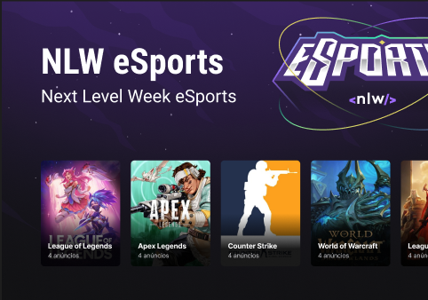
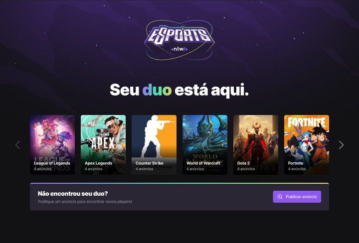
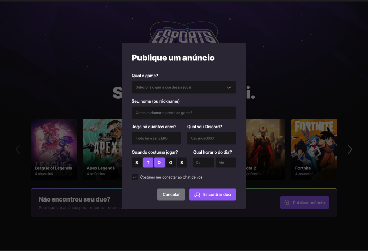
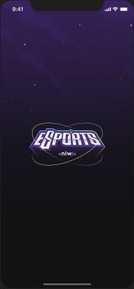
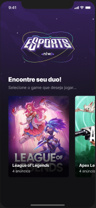
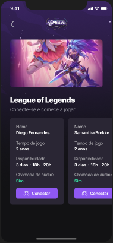
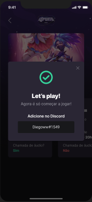
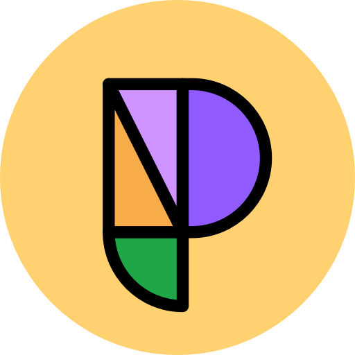
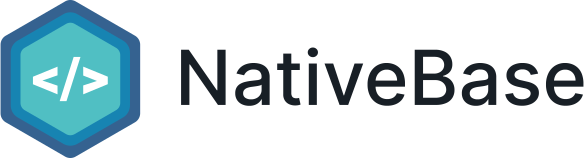

  <h1> NLW eSports </h1>

 

  

 
 

|                                                                                     |                                                                                   |                                                                                        |
| :---------------------------------------------------------------------------------: | :-------------------------------------------------------------------------------: | :------------------------------------------------------------------------------------: |
|  |  |       |
|      |      |  |

 

 <a href="#theproject">The Project</a> •
 <a href="#target">Target</a> •
 <a href="#technologies">Technologies</a> •
 <a href="#route">Route</a> •
 <a href="#howtouse">How to Use</a>

 

<h2> 📓 The Project </h2>

 NLW eSports platform to connect gamers who play the same eSport (web platform and mobile) 

<h2> 💡 Target </h2>
Development of an NLW eSports platform to connect gamers who play the same eSport (web platform and mobile versions) at NLW (Next Level Week), from Rocketseat

 

<h2> 🛠 Technologies </h2>
The following tools were used in building the project:  

|                       Type                       |           Tools           |            References             |
| :----------------------------------------------: | :-----------------------: | :-------------------------------: |
|                       IDE                        |          VS CODE          |  https://code.visualstudio.com/   |
|              Design Interface Tool               | FIGMA (Prototype - UX/UI) |      https://www.figma.com/       |
|         Programming Language (Frontend)          |           REACT           |       https://reactjs.org/        |
|          Programming Language (Mobile)           |       REACT NATIVE        |     https://reactnative.dev/      |
| Programming Language (Backend, Frontend, Mobile) |        TYPESCRIPT         |  https://www.typescriptlang.org/  |
|        API and backend services (Backend)        |          NODE.JS          |        https://nodejs.org/        |
|          NodeJS web framework (Backend)          |          EXPRESS          |      https://expressjs.com/       |
| Open source API development ecosystem (Testing)  |        HOPPSCOTCH         |      https://hoppscotch.io/       |
|          Open source platform (Mobile)           |    EXPO BARE WORKFLOW     |         https://expo.dev/         |
|      Utility-first CSS Framework (Frontend)      |       TAILWIND CSS        |     https://tailwindcss.com/      |
|    Tool for transforming CSS with JavaScript     |         POST CSS          |       https://postcss.org/        |
|      Graphic components (Frontend, Mobile)       |      PHOSPHOR ICONS       |    https://phosphoricons.com/     |
|   UI Utility-first Component Library (Mobile)    |        NATIVE BASE        |      https://nativebase.io/       |
|        Navigation between pages (Mobile)         |     REACT NAVIGATION      |   https://reactnavigation.org/    |
|                Database (Backend)                |          SQLITE           | https://www.sqlite.org/index.html |
|  Promise based HTTP client - browser & Node.js   |           AXIOS           |      https://axios-http.com/      |
|             UI Components for React              |         RADIX-UI          |     https://www.radix-ui.com/     |
|            Node.js and TypeScript ORM            |          PRISMA           |      https://www.prisma.io/       |
|     Tool to build frontend faster (Frontend)     |          VITE.JS          |        https://vitejs.dev/        |
|             eSport Streaming Service             |          TWITCH           |      https://www.twitch.tv/       |
|                  Deploy Project                  |          VERCEL           |        https://vercel.com/        |

 

  <h3>Backend | API</h3>
  
  
  
  
   
  <h3>Testing</h3>
  
   
  <h3>Database</h3>
  
  
   
  <h3>IDE</h3>
  
   
  <h3>UX/UI</h3>
  
  
  
   
  <h3>Frontend</h3>
  
  
  
   
  
  
   
  <h3>Mobile</h3>
  
  
  
  
   
  <h3>Deploy</h3>
  
   

<h2> 🔎 Route </h2>
  <ol>
    <li &nbsp;>Part 1 - Base Building 
      <ul &nbsp;>
        <li &nbsp;>Build the project prototype: https://www.figma.com/file/npwloJcPtSmKG6xsuwNltZ/NLW-eSports-(Community)?node-id=0%3A1</li>
        <li>Install VS Code (IDE)</li>
        <li>Install VS Code extensions: NodeJS, Prisma, SQLite, Tailwind CSS IntelliSense, PostCSS Language Support</li>
        <li &nbsp;><b>Backend project</b>
          <ul>
            <li>Create a new project: mkdir backend</li>
            <li>Enter backend project: cd backend</li>
            <li>Install Node and start: npm init -y</li>
            <li>Install Express framework:
              <ul>
                <li>npm i express</li>
                <li>npm i @types/express -D (Support with TS)</li>
              </ul>
            </li>
            <li>Configure server, routes and ports: ./src/server.mjs</li>
            <li>Run the settings: node src/server.mjs</li>
            <li>Install TypeScript for development environment:
              <ul>
                <li>npm i typescript -D</li>
                <li>npx tsc --init (Settings file for TS)</li>
                <li>npm i ts-node-dev -D (Automatically updates)</li>
                <li>Change ts config file: ./tsconfig.json</li>
              </ul>
            </li>
            <li>Convert server file to ts: ./src/server.ts</li>
            <li>Create a JS file from a TS server file: npm run build</li>
            <li>Run the project: node src/server.js</li>
            <li>Configure the package.json: ./package.json </li>
            <li>Run the application: npm run dev</li>
          </ul>
        </li>
        <li &nbsp;><b>Testing</b>
          <ul>
            <li>Install Hoppscotch app and the extension for Chrome: https://hoppscotch.io/</li>
          </ul>
        </li>
        <li &nbsp;><b>Frontend project</b>
          <ul>
            <li>Create the frontend project (React, Vite and TypeScript): npm create vite@latest</li>
            <li>Install de dependencies from package.json: npm i</li>
            <li>Install Tailwind CSS, PostCSS and autoprefixer: npm i tailwindcss postcss autoprefixer -D</li>
            <li>Start Tailwind CSS: npx tailwindcss init -p</li>
            <li>To run project: npm run dev</li>
          </ul>
        </li>
        <li &nbsp;><b>Mobile project</b>
          <ul>
            <li>Install "R Component" extension at VS Code</li>
            <li>Install Expo CLI: npm install --global expo-cli</li>
            <li>Create a new project: expo init my-app (bare workflow)</li>
            <li>Navigate to project directory: cd my-app</li>
            <li>Open the project on VS Code: code .</li>
            <li>Change App.js to App.tsx</li>
            <li>Create and set tsconfig.json at root</li>
            <li>Install Native Base on project:
              <ul>
                <li>yarn add native-base</li>
                <li>expo install react-native-svg </li>
                <li>expo install react-native-safe-area-context</li>
              </ul>
            </li>
            <li>Install React Navigation on project:
              <ul>
                <li>expo install @react-navigation/native</li>
                <li>expo install react-native-screens</li>
                <li>expo install react-native-safe-area-context</li>
                <li>expo install @react-navigation/native-stack</li>
              </ul>
            </li>
            <li>Install Google Fonts: expo install expo-font @expo-google-fonts/inter</li>
            <li>Install Linear Gradient libary: expo install expo-linear-gradient</li>
            <li>Start the development server: expo start</li>
            <li>Configure the Expo Go on a mobile device or use an emulator</li>
            <li>Open the app on a mobile device:
              <ul>
                <li>On your iPhone or iPad, open the default Apple "Camera" app and scan the QR code you see in the terminal</li>
                <li>On your Android device, press "Scan QR Code" on the "Projects" tab of the Expo Go app and scan the QR code you see in the terminal.</li>
              </ul>
            </li>
          </ul>
        </li>
      </ul>
    </li>
     
    <li &nbsp;>Part 2 - High Speed 
      <ul &nbsp;>
        <li &nbsp;><b>Frontend project</b>
          <ul>
            <li>Customize contents, themes, fonts and plugins with Tailwind: ./tailwind.config.js</li>
            <li>Customize the main style: ./src/styles/main.css</li>
            <li>Convert a svg file (Logo) code to React component: https://svg2jsx.com/</li>
            <li>Install Phosphor Icons: npm i phosphor-react</li>
            <li>Set Google Fonts: ./index.html</li>
            <li>Set the Landing Page: ./src/App.tsx</li>
          </ul>
        </li>
        <li &nbsp;><b>Mobile project</b>
          <ul>
            <li>Set images, theme and utils for the project</li>
            <li>Load customized font: ./src/App.tsx</li>
            <li>Create the Splash Page</li>
            <li>Create components: Background, GameCard, Heading, Loading</li>
            <li>Create Home screen: ./src/screens/Home/index.tsx</li>
          </ul>
        </li>
      </ul>
     
    <li &nbsp;>Part 3 - To be continued 
      <ul &nbsp;> 
        <li &nbsp;><b>Backend project</b>
          <ul>
            <li>Define "Use Cases"</li>
            <li>Set routes</li>
            <li>Install and set Prisma
              <ul>
                <li>Install (for development): npm i prisma -D</li>
                <li>Set Database SQLite: npx prisma init --datasource-provider SQLite</li>
                <li>Create tables and entities (Game, Ads): ./prisma/schema.prisma</li>
                <li>Relation between entities:
                  <ul>
                    <li>Game and Ads: One to Many</li>
                  </ul>
                </li>
                <li>Run migrations: npx prisma migrate dev
                  <ul>
                    <li>Name for the new migration: create table games</li>
                    <li>Name for the new migration: create table ads</li>
                  </ul>
                </li>
                <li>To see DB generated from Prisma: npx prisma studio</li>
                <li>Install Prisma Client: npm i @prisma/client</li>
                <li>Generate: npx prisma generate</li>
              </ul>
            </li>
            <li>Cors library (Protection for non-desirable access) 
              <ul>
                <li> npm i @types/cors -D </li>
                <li> npm i @types/cors </li>
              </ul>
            </li>
          </ul>
        </li>
        <li &nbsp;><b>Testing</b>
          <ul>
            <li>Test backend at Hoppscotch: https://hoppscotch.io/</li>
          </ul>
        </li>
      </ul>
    </li>
     
    <li &nbsp;>Part 4 - Power up 
      <ul &nbsp;>
        <li &nbsp;><b>Frontend project</b>
          <ul>
            <li>Create components: GameBanner, CreateAdBanner</li>
            <li>Use React Hooks: useState, useEffect</li>
            <li>Listing games</li>
            <li>Create feature: publish an ad (modal)
              <ul>
                <li>Install Radix-UI: npm i @radix-ui/react-dialog </li>
              </ul>
            </li>
            <li>Create Input component: ./src/components/Form/Input.tsx</li>
            <li>Connect with API (backend service)</li>
          </ul>
        </li>
        <li &nbsp;><b>Mobile project</b>
          <ul>
            <li>Create Game page: ./src/screens/Game/index.tsx</li>
            <li>Set Routes
              <ul>
                <li>Native Stack Navigator: ./src/routes/app.routes.tsx</li>
                <li>Navigation Strategy: ./src/routes/index.tsx</li>
                <li>Comunnicate to TS which routes are available: ./src/@types/navigation.d.ts</li>
              </ul>
            </li>
            <li>Create components: DuoCard, DuoInfo</li>
            <li>React Native Phosphor Icon Library: npm install --save phosphor-react-native</li>
            <li>React Native Svg Library: expo install react-native-svg</li>
            <li>Connect with API (backend service)</li>
          </ul>
        </li>
      </ul> 
    </li> 
     
    <li &nbsp;>Part 5 - Final Round 
      <ul &nbsp;>
        <li &nbsp;><b>Frontend project</b>
          <ul>
            <li>Create component: CreateAdModal</li>
            <li>Use Radix UI Components 
              <ul>
                <li>Checkbox = npm install @radix-ui/react-checkbox</li>
                <li>Select = npm install @radix-ui/react-select</li>
                <li>Toggle Group = npm install @radix-ui/react-toggle-group</li>
              </ul>
            </li>
            <li>Send Ad modal values to API (backend service)
              <ul>
                <li>Axios: npm install axios</li>
              </ul>
            </li>
          </ul>
        </li>
        <li &nbsp;><b>Mobile project</b>
          <ul>
            <li>Create component: DuoMatch (Modal)</li>
            <li>Set navigation from Game modal to DuoMatch (modal)</li>
            <li>Use UI Icons
              <ul>
                <li>Vector-Icons (Expo): MaterialIcons</li>
                <li>Phosphor Icon React Native: CheckCircle </li>
                <li>Comunnicate to TS which routes are available: ./src/@types/navigation.d.ts</li>
              </ul>
            </li>
            <li>New Features
              <ol>
                <li>Condional open and close DuoMatch (modal) from Game page (screen)</li>
                <li>Open DuoMatch (modal) when click at Connect button on Game page (screen)</li>
                <li>When click at discordUser from DuoMatch (modal), keep this info to transfer area
                  <ul>
                    <li>Clipboard library: expo install expo-clipboard</li>
                  </ul>
                </li>
                <li>Sending notifications (push), when keeping discordUser at device clipboard
                  <ul>
                    <li>Expo Notifications library: expo install expo-notifications</li>
                    <li>New Services
                      <ul>
                        <li>Set user notifications configuration from this app</li>
                        <li>Find device identificator token (getPushNotificationToken)</li>
                        <li>Expo Modules Core library: expo install expo-modules-core</li>
                        <li>Keep some devices references (useRef hook): getNotificationListener, responseNotificationListener</li>
                        <li>Send the notification to an specific device by notification token </li>
                      </ul>
                    </li>
                  </ul>
                </li>
              </ol>
            </li>
            <li>Before executing app:
              <ol>
                <li>At terminal: expo login</li>
                <li>Enter your login credentials (user and password)</li>
              </ol>
            </li>
            <li>Start the app with expo: expo start</li>
            <li>Test notifications using web interface (Push notifications tools): http://expo.dev/notifications</li>
          </ul>
        </li>
      </ul> 
    </li>
     
    <li &nbsp;>Part 6 - The Next Level 
      <ul &nbsp;>
        <li>Install GraphQL Code Generator: 
          * npm i @graphql-codegen/cli 
          * npm i @graphql-codegen/typescript 
          * npm i @graphql-codegen/typescript-operations 
          * npm i @graphql-codegen/typescript-react-apollo
        </li>
        <li>Create a GraphQL Code Generator file: codegen.yml</li>
        <li>Create a GraphQL directory: ./graphql</li>
        <li>Inside GraphQL directory, create  
          * Mutations folder: ./graphql/mutations/ 
          * Queries folder:   ./graphql/queries/
        </li>
        <li>Create a file to each query into Queries folder</li>
        <li>Create a file to each mutation into Mutations folder</li>
        <li>Use Queries and Mutations files in the respective components</li>
        <li>Add codegen to package.json file: 
          * "codegen": "graphql-codegen"
        </li>
        <li>Execute GraphQL Code Gen file: npm run codegen</li>
        <li>Use hooks generated from GraphQL Code Gen at respective component files</li>
        <li>Deploy at Vercel</li>
      </ul> 
    </li>
  </ol>

 

<h2>🧪 How to use</h2>
  <ol &nbsp;>
    <li &nbsp;>Set the development environment at you local computer</li>
    <li &nbsp;>Clone the repository
      <ul>
        <li>git clone https://github.com/alexandrecpedro/eSports</li>
      </ul>
    </li>
    <li &nbsp;>Enter the project directory:
      <ul>
        <li>cd eSports</li>
      </ul>
    </li>
    <li><b>Testing</b>
      <ul>
        <li &nbsp;><u>Backend</u>
          <ol>
            <li &nbsp;>Enter the directory
              <ul>
                <li>cd backend</li>
              </ul>
            </li>
            <li &nbsp;>Install the dependencies
              <ul>
                <li>npm install</li>
              </ul>
            </li>
            <li &nbsp;>Run
              <ul>
                <li>npm run dev</li>
              </ul>
            </li>
          </ol>
        </li>
        <li &nbsp;><u>Frontend</u>
          <ol>
            <li &nbsp;>Enter the directory
              <ul>
                <li>cd frontend</li>
              </ul>
            </li>
            <li &nbsp;>Install the dependencies
              <ul>
                <li>npm install</li>
              </ul>
            </li>
            <li &nbsp;>Run
              <ul>
                <li>npm run dev</li>
              </ul>
            </li>
          </ol>
        </li>
        <li &nbsp;><u>Mobile</u>
          <ol>
            <li &nbsp;>Enter the directory
              <ul>
                <li>cd mobile</li>
              </ul>
            </li>
            <li &nbsp;>Before run the mobile app, check if the following tools are already installed:
              <ul>
                <li &nbsp;><u>Node.js LTS release</u>
                  <ul>
                    <li>https://nodejs.org/en/</li>
                  </ul>
                </li>
                <li &nbsp;><u>Git</u>
                  <ul>
                    <li>https://git-scm.com/downloads</li>
                  </ul>
                </li>
                <li &nbsp;><u>Watchman (only for MacOS and Linux users)</u>
                  <ul>
                    <li>https://facebook.github.io/watchman/docs/install#buildinstall</li>
                  </ul>
                </li>
                <li &nbsp;><u>Expo CLI</u>
                  <ul>
                    <li>npm install --global expo-cli</li>
                  </ul>
                </li>
              </ul>
            </li>
            <li &nbsp;>Install the dependencies
              <ul>
                <li>npx install-expo-modules@latest</li>
                <li &nbsp;>npm install expo</li>
                <li &nbsp;>expo install</li>
              </ul>
            </li>
            <li &nbsp;>Run
              <ul>
                <li>expo start</li>
              </ul>
            </li>
          </ol>
        </li>
      </ul>
    </li>
  </ol>

