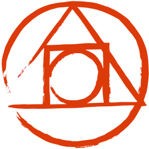

    <h1> eSports </h1>

 

   

 
 

|                                                                           |                                                                      |                                                                         | 
|:------------------------------------------------------------------------------:|:--------------------------------------------------------------------:|:-------------------------------------------------------------------------------------:|
|         |  |  |
|  |        |     |    |
 

 <a href="#theproject">The Project</a> •
 <a href="#target">Target</a> •
 <a href="#technologies">Technologies</a> •
 <a href="#route">Route</a> •

 

<h2> 📓 The Project </h2>

 eSports platform to connect gamers who play the same eSport (web platform and mobile) 

<h2> 💡 Target </h2>
Development of an eSports platform to connect gamers who play the same eSport (web platform and mobile versions) at NLW (Next Level Week), from Rocketseat

 

<h2> 🛠 Technologies </h2>
The following tools were used in building the project:  

|                     Type                     |         Tools          |                           References                           |
|:--------------------------------------------:|:----------------------:|:--------------------------------------------------------------:|
|                     IDE                      |         VS CODE        |            https://code.visualstudio.com/                    |
|        Design Interface Tool                 | FIGMA  (Prototype - UX/UI)  |              https://www.figma.com/                           | 
|       Programming Language (App)             |          REACT         |            https://reactjs.org/                                 | 
|       Programming Language (App)             |       TYPESCRIPT       |            https://www.typescriptlang.org/                  |
|          API and backend services            |         NODE.JS        |            https://nodejs.org/                                 |
|        Supergraph Platform for GraphQL       |         APOLLO         |            https://www.apollographql.com/                   |
|  Utility-first CSS Framework                 |      TAILWIND CSS      |            https://tailwindcss.com/                                 | 
|  Tool for transforming CSS with JavaScript   |         POST CSS       |            https://postcss.org/                                 | 
|              Graphic components              |     PHOSPHOR ICONS     |            https://phosphoricons.com/                   |
|        Tool to build frontend faster         |         VITE.JS        |            https://vitejs.dev/                                 |
|          Media Player Framework              |         VIME.JS        |            https://vimejs.com/                                 |
|              Deploy Project                  |         VERCEL         |            https://vercel.com/                                 |
 

  <h3>Backend | API</h3>
  
   
  <h3>Database</h3>
  
   
  <h3>IDE</h3>
  
   
  <h3>UX/UI</h3>
  
  
   
  <h3>Frontend</h3>
  
  
  
   
  
  
  
   
  
   
  <h3>Deploy</h3>
  
   

 

<h2> 🔎 Route </h2>

<ol>
    <li>Part 1 - Base Building
      <ul>
        <li>Build the project prototype: https://www.figma.com/file/npwloJcPtSmKG6xsuwNltZ/NLW-eSports-(Community)?node-id=0%3A1</li>
        <li>Install VS Code (IDE)</li>
        <li>Install VS Code extensions: NodeJS, Tailwind CSS IntelliSense, PostCSS Language Support</li>
        <li>Create a new project: npm create vite@latest</li>
        <li>Install Tailwind CSS, PostCSS and autoprefixer: npm i tailwindcss postcss autoprefixer -D</li>
        <li>Start Tailwind CSS: npx tailwindcss init -p</li>
        <li>Creating database content at GraphCMS (API)</li>
        <li>Install Apollo Client, GraphQL: npm i @apollo/client graphql</li>
        <li>Integrate Apollo Client with our application</li>
      </ul>
    </li>
     
    <li>Part 2 - High Speed
      <ul>
        <li>Create components: Header, Sidebar, Video, Lesson</li> 
        <li>Convert a svg file (Logo) code to React component: https://svg2jsx.com/</li>
        <li>Create Logo component</li>
        <li>Customize color with Tailwind: ./tailwind.config.js</li>
        <li>Create Event page</li>
        <li>Install Phosphor Icons: npm i phosphor-react</li>
        <li>Adding Phosphor Icons to Lesson component</li>
        <li>Install one of these libraries to work with date at ReactJS:  
            * Date-fns: npm i date-fns (on this application) 
            * DayJS: npm i dayjs
        </li>
        <li>Adding Date-fns to Lesson component</li>
        <li>Adding functions to components</li>
        <li>Add pages and components to App.tsx</li>
      </ul>
     
    <li>Part 3 - Class routing and player</li>
      <ul>  
        <li>Build the Video component: ./components/Video.tsx</li>
        <li>Install the video library VIME: npm i @vime/core @vime/react</li>
        <li>Install React-Router-Dom: npm i react-router-dom</li>
        <li>Build Router file: ./Router.tsx</li>
        <li>Add class routing</li>
      </ul>
    </li>
     
    <li>Part 4 - Subscription via GraphQL
      <ul>
        <li>Create Subscribe page: ./pages/Subscribe.tsx</li>
        <li>Configure Management API access permissions from GraphCMS</li>
        <li>Integrate this Management API access permission to the project</li>
        <li>Using environmental variables at apollo.ts</li>
        <li>Build a mutation at Subscribe page</li>
        <li>Set permissions to Subscriber at GraphCMS API</li>
        <li>Install Classnames library: npm i classnames</li>
        <li>Use Classnames library at Lesson component: ./components/Lesson.tsx</li>
      </ul> 
    </li> 
     
    <li>Part 5 - Deploy, CodeGen and next steps
      <ul>
        <li>Install GraphQL Code Generator: 
          * npm i @graphql-codegen/cli 
          * npm i @graphql-codegen/typescript 
          * npm i @graphql-codegen/typescript-operations 
          * npm i @graphql-codegen/typescript-react-apollo
        </li>
        <li>Create a GraphQL Code Generator file: codegen.yml</li>
        <li>Create a GraphQL directory: ./graphql</li>
        <li>Inside GraphQL directory, create  
          * Mutations folder: ./graphql/mutations/ 
          * Queries folder:   ./graphql/queries/
        </li>
        <li>Create a file to each query into Queries folder</li>
        <li>Create a file to each mutation into Mutations folder</li>
        <li>Use Queries and Mutations files in the respective components</li>
        <li>Add codegen to package.json file: 
          * "codegen": "graphql-codegen"
        </li>
        <li>Execute GraphQL Code Gen file: npm run codegen</li>
        <li>Use hooks generated from GraphQL Code Gen at respective component files</li>
        <li>Deploy at Vercel</li>
      </ul> 
    </li>
</ol>

